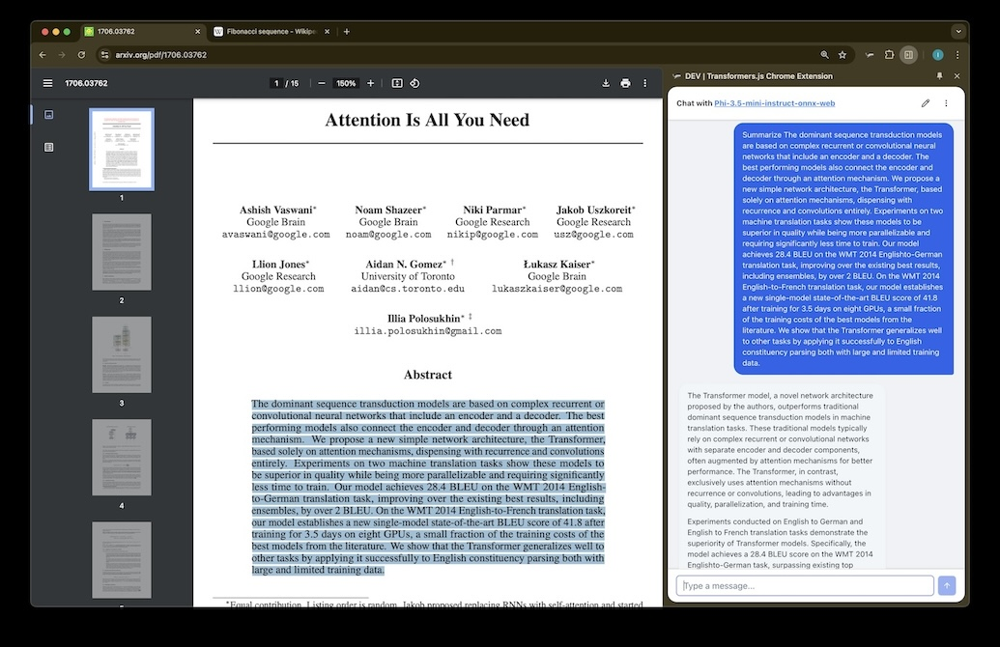
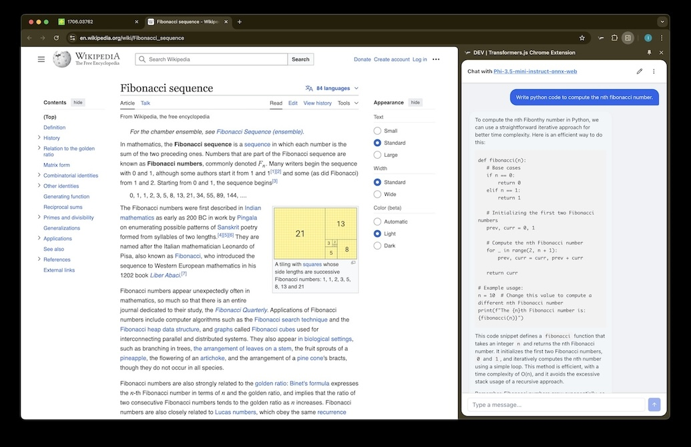
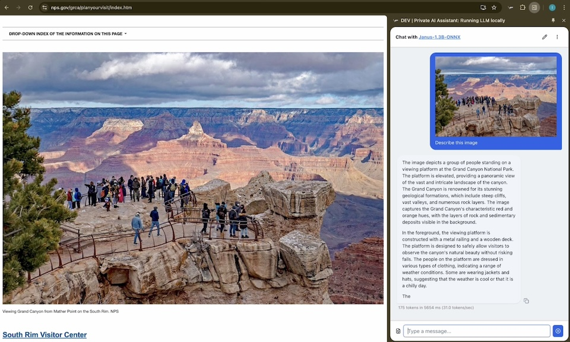
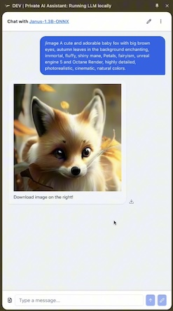
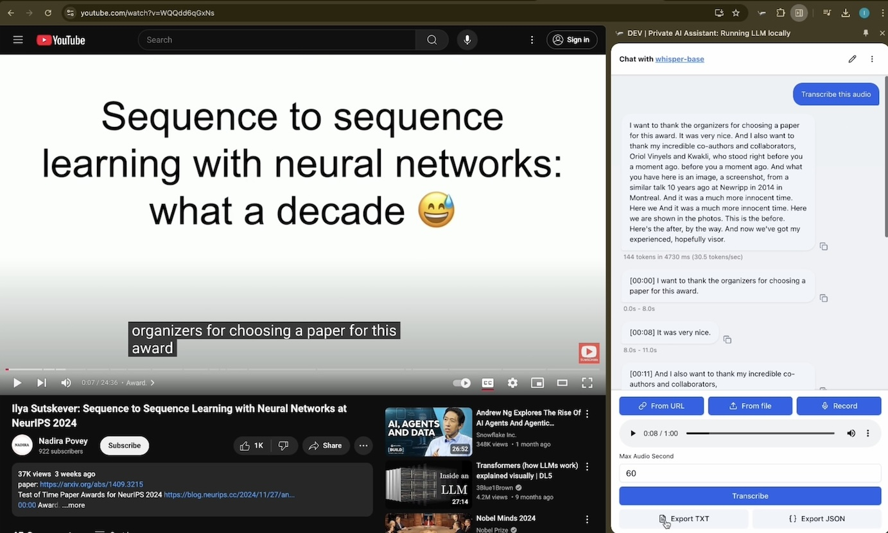
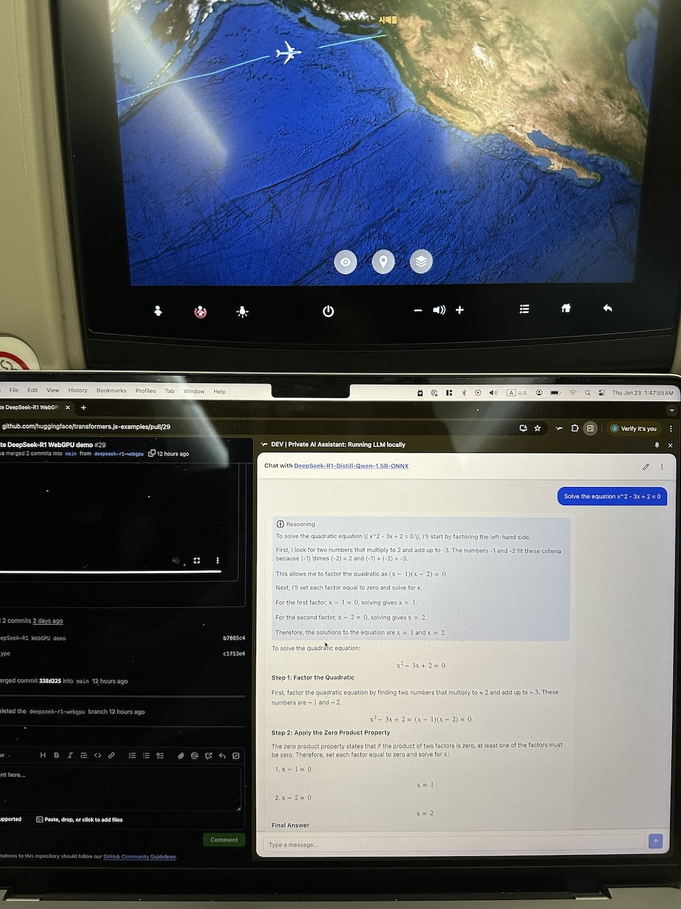
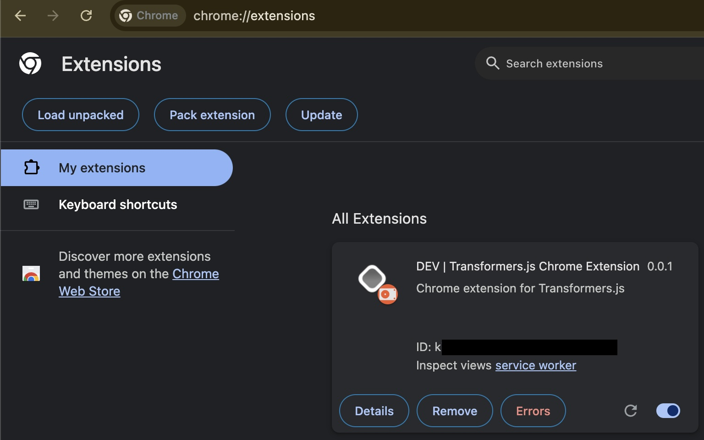
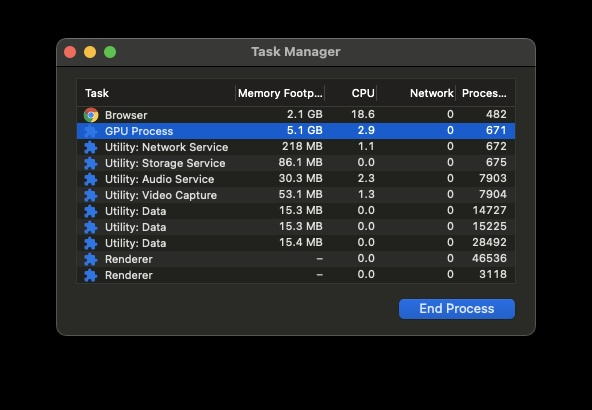
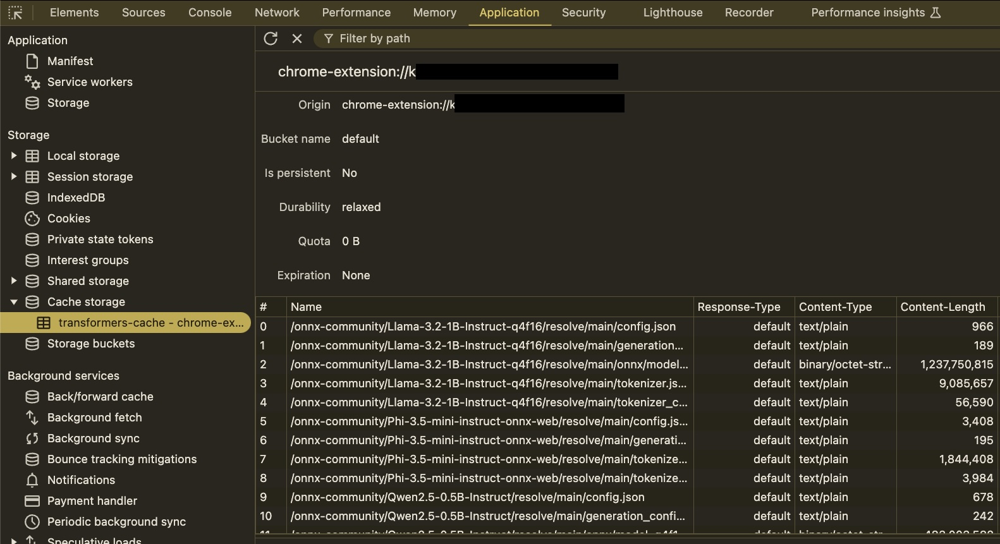

# TinyWhale

**Open source monorepo for on-device AI inference** — run LLMs directly in the browser as a [web app](https://tiny-whale.vercel.app) or [Chrome extension](https://chromewebstore.google.com/detail/private-ai-assistant-runn/jojlpeliekadmokfnikappfadbjiaghp). No servers, no API keys, no data leaves your device.

Built with [Transformers.js](https://github.com/huggingface/transformers.js) + [ONNX Runtime Web](https://onnxruntime.ai/) + [WebGPU](https://developer.mozilla.org/en-US/docs/Web/API/WebGPU_API), structured as a **Turborepo monorepo** with shared packages for UI, auth, and API — so the same inference pipeline powers both the web app and the Chrome extension.

> **Note:** This project is under active development. APIs, features, and code structures may change without notice.

## Try It

- **Web Demo** — [tiny-whale.vercel.app](https://tiny-whale.vercel.app)
- **Chrome Extension** — [Chrome Web Store](https://chromewebstore.google.com/detail/private-ai-assistant-runn/jojlpeliekadmokfnikappfadbjiaghp)
- **Demo Videos** — [Intro](https://www.youtube.com/watch?v=yXZQ8FHtSes) | [Advanced Usage](https://www.youtube.com/watch?v=MSCDdFG5Lls)

## How It Works

1. **Load** — A quantized open source LLM (~500MB) is downloaded into your browser and cached locally
2. **Chat** — All inference runs on your GPU via WebGPU. Conversations never leave your device
3. **Customize** — Adjust temperature, top-p, top-k, and other generation parameters in real-time

## Examples

| Task                | Example                                                          |
| ------------------- | ---------------------------------------------------------------- |
| Text Summarization  |       |
| Code Generation     |         |
| Image Understanding |      |
| Image Generation    |  |
| Speech to Text      |      |
| Reasoning           |                |

## Features

- [x] In-browser LLM inference via WebGPU (Chrome extension + web app)
- [x] Multiple model support: Llama, Phi, SmolLM, Qwen, DeepSeek R1
- [x] Multimodal: image understanding (Janus) and speech-to-text (Whisper)
- [x] Configurable generation parameters (temperature, top-p, top-k, etc.)
- [x] Streaming token output with real-time TPS metrics
- [x] Model caching for instant subsequent loads
- [x] Works offline once the model is loaded
- [x] Markdown rendering in chat responses
- [ ] Text-to-Speech (OuteTTS)
- [ ] SAM (Segment Anything), text classification
- [ ] Chat history (local storage, export)
- [ ] Resource management (unload models, orchestrate generations)

## Roadmap

| Platform | Status | Tech |
| --- | --- | --- |
| Web | Live | Next.js + WebGPU |
| Chrome Extension | Live | Plasmo + WebGPU |
| iOS | Planned | Expo / React Native + Core ML |
| Android | Planned | Expo / React Native + NNAPI |
| macOS / Windows / Linux | Planned | Tauri or Electron + ONNX Runtime |

## Performance

Measured on MacBook Pro M1 Max (32GB RAM). Prompt: "Write python code to compute the nth fibonacci number."

| Model | Throughput |
| --- | --- |
| [Qwen3.5-0.8B](https://huggingface.co/onnx-community/Qwen3.5-0.8B-ONNX) (q4f16) | ~45 tok/s |
| [SmolLM2-1.7B](https://huggingface.co/HuggingFaceTB/SmolLM2-1.7B-Instruct) (q4f16) | 46.2 tok/s |
| [Llama-3.2-1B](https://huggingface.co/onnx-community/Llama-3.2-1B-Instruct-q4f16) (q4f16) | 40.3 tok/s |
| [Qwen2.5-Coder-1.5B](https://huggingface.co/onnx-community/Qwen2.5-Coder-1.5B-Instruct) (q4f16) | 36.1 tok/s |
| [Phi-3.5-mini](https://huggingface.co/onnx-community/Phi-3.5-mini-instruct-onnx-web) (q4f16) | 32.9 tok/s |
| [DeepSeek R1](https://huggingface.co/onnx-community/DeepSeek-R1-Distill-Qwen-1.5B-ONNX) (q4f16) | 32.7 tok/s |
| [Janus 1.3B](https://huggingface.co/onnx-community/Janus-1.3B-ONNX) (q4f16) | 30.9 tok/s |
| [Whisper Base](https://huggingface.co/onnx-community/whisper-base) (fp32 + q4) | 30.5 tok/s |

## Project Structure

Monorepo using [Turborepo](https://turborepo.com) with pnpm workspaces.

```text
apps
  ├─ plasmo          Chrome extension (MV3) — Transformers.js + WebGPU
  ├─ nextjs          Next.js 16 web app — landing page + in-browser chat
  ├─ expo            Expo SDK 54 / React Native mobile app
  └─ tanstack-start  Tanstack Start web app
packages
  ├─ api             tRPC v11 router
  ├─ auth            Authentication (better-auth)
  ├─ db              Database (Drizzle + Supabase)
  └─ ui              Shared UI components (shadcn-ui)
tooling
  ├─ eslint          Shared ESLint presets
  ├─ prettier        Shared Prettier config
  ├─ tailwind        Shared Tailwind theme
  └─ typescript      Shared tsconfig
```

## Getting Started

### Prerequisites

Make sure to follow the system requirements in [`package.json#engines`](./package.json#L4).

```bash
pnpm install
```

### Web App (Next.js)

```bash
pnpm dev:next
```

Open [http://localhost:3000](http://localhost:3000) and navigate to `/chat`.

### Chrome Extension

```bash
pnpm dev:chrome
```

Open `chrome://extensions`, enable Developer mode, click "Load unpacked", and select `apps/plasmo/build/chrome-mv3-dev`.

Or install from the [Chrome Web Store](https://chromewebstore.google.com/detail/private-ai-assistant-runn/jojlpeliekadmokfnikappfadbjiaghp).

### Firefox Extension

```bash
pnpm dev:firefox
```

Navigate to `about:debugging#/runtime/this-firefox`, click "Load Temporary Add-on", and select any file inside `apps/plasmo/build/firefox-mv2-dev`.

> **Known issues:**
> - Firefox WebGPU has limited GPU memory. Use the smallest models (e.g. Qwen2.5-0.5B) to avoid "Not enough memory" errors. Models 0.8B+ (including Qwen3.5-0.8B) may fail.
> - `q4f16` dtype is not supported without `shader-f16` — the extension automatically falls back to `q4`.
> - HMR (hot module reload) websocket does not connect in Firefox extensions. Code changes require manually reloading the extension.

### Safari Extension (macOS)

```bash
cd apps/plasmo
pnpm build:safari
```

This builds the Chrome MV3 production bundle, then converts it to a Safari Web Extension Xcode project at `build/safari/`. Open the Xcode project, build and run, then enable the extension in Safari > Settings > Extensions.

**Prerequisites:** Xcode 14+ with `safari-web-extension-converter` (included with Xcode command line tools).

> **Known issues:**
> - Safari does not support `sidePanel` — the conversion script strips it from the manifest.
> - WebGPU support in Safari is experimental and may vary by macOS version.

### All Apps

```bash
pnpm dev
```

### Both Chrome + Firefox

```bash
pnpm dev:plasmo
```

Runs both dev servers in parallel via Turborepo TUI.

## Deployment

### Chrome Extension

```bash
cd apps/plasmo
pnpm build && pnpm package
```

Creates a production bundle ready for the Chrome Web Store. See [Plasmo's submission guide](https://docs.plasmo.com/framework/workflows/submit) for automated deployment via GitHub Actions.

### Firefox Extension

```bash
cd apps/plasmo
pnpm build:firefox && pnpm package:firefox
```

Creates a zip ready for [Firefox Add-ons](https://addons.mozilla.org/).

### Safari Extension

```bash
cd apps/plasmo
pnpm build:safari
```

Produces an Xcode project at `build/safari/`. Archive and distribute via Xcode.

### Next.js (Vercel)

Deploy to [Vercel](https://vercel.com) with `apps/nextjs` as the root directory.

## Testing

```bash
cd apps/plasmo
pnpm test:background   # Smoke test Chrome prod build for missing modules
pnpm test:firefox      # Smoke test Firefox prod build for missing modules
pnpm test:safari       # Verify Safari prerequisites + smoke test Chrome build
```

Run `pnpm test:background` after any change to aliases, stubs, postinstall, postbuild, or dependencies.

## Debugging

### Chrome

Open `chrome://extensions` and find "Inspect views" for the extension.



### Firefox

Navigate to `about:debugging#/runtime/this-firefox` and click "Inspect" on the extension to open the background script console.

### Memory Usage

Chrome > More Tools > Task Manager.



### Cached Models

In the extension inspector, go to Application > Local Storage > `transformers-cache`.



## References

- [Transformers.js](https://github.com/huggingface/transformers.js) and [examples](https://github.com/huggingface/transformers.js-examples)
- [ONNX Runtime Web](https://onnxruntime.ai/)
- [Plasmo Framework](https://docs.plasmo.com/)
- [WebLLM](https://webllm.mlc.ai/)
- [create-t3-turbo](https://github.com/t3-oss/create-t3-turbo) — Monorepo template
